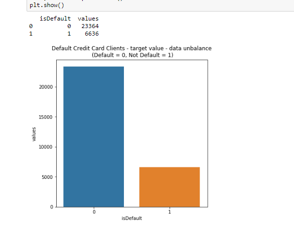
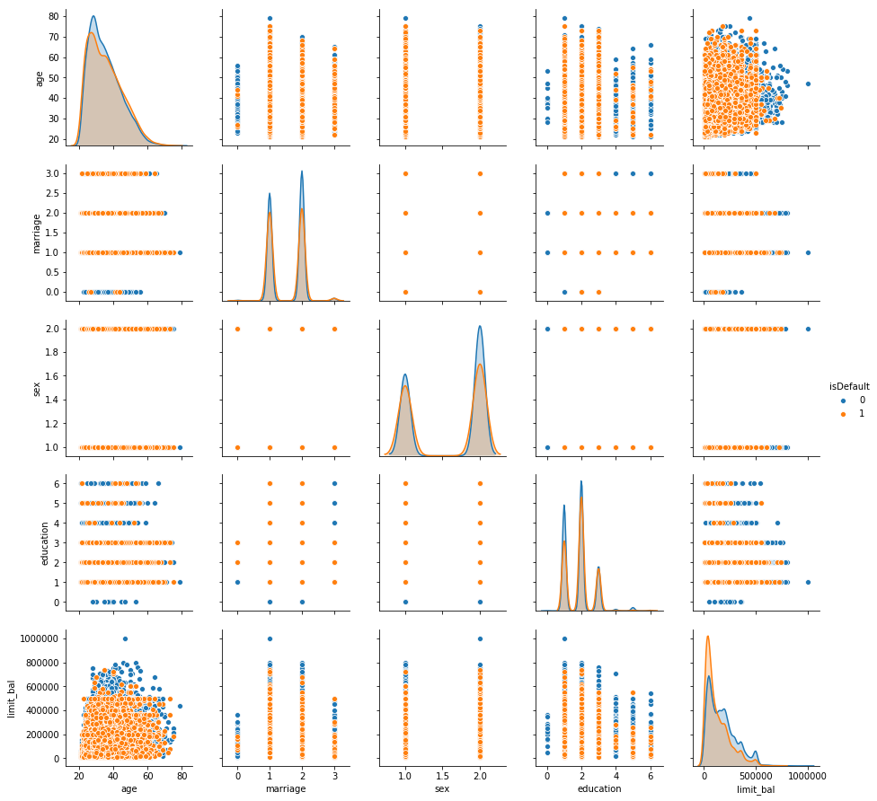
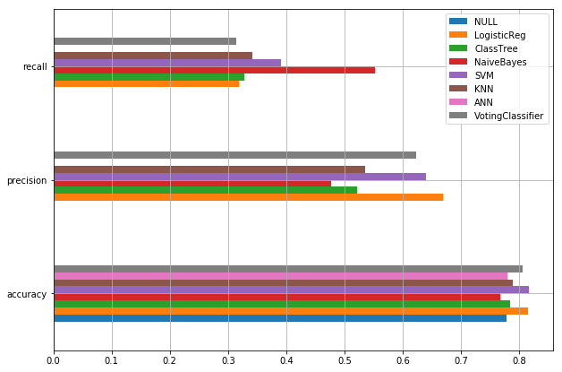
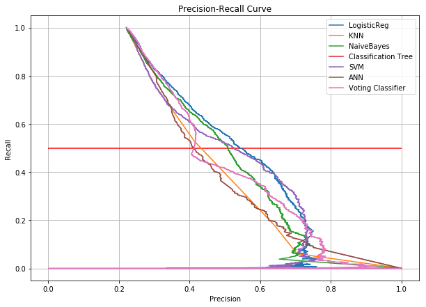

# Fraud-detection-Machine-Learning

Credit card fraud detection machine learning project source code and presentation.

<!-- TOC -->

- [1. DEMO](#1-demo)
- [2. Abstract](#2-abstract)
- [3. Aims & Objectives](#3-aims--objectives)
- [4. METHODOLOGY](#4-methodology)
  - [4.1. Data Description:](#41-data-description)
  - [4.2. Process](#42-process)
- [5. EVALUATION](#5-evaluation)
  - [5.1. Precision-Recall Curve comparison:](#51-precision-recall-curve-comparison)
- [6. GUI](#6-gui)
- [7. SUMMARY](#7-summary)
- [8. Author](#8-author)

<!-- /TOC -->

## 1. DEMO

[**DEMO**](./Project%20DEMO%20Video.mp4')

## 2. Abstract

In modern day’s credit card plays an important role in every person’s daily activity. Customer purchases their needs with their credit cards and online transitions. Banks and financial institutes consider denying the credit applications of customers to avoid the risk of defaulters. Credit risk is the rise of debt on the customer who fails to make the billing payment for some period. The purpose of the project is how to reduce the defaulters among the list of customers, and make a background check on whether to provide the loan or not and to find the promising customers. These predictive models would benefit the lending institutions and to the customers as it would make them more aware of their potential defaulting rate. The problem is a binary classification problem whether a customer will be defaulting to pay next month payment. The dataset is unbalanced so the focus was on the precision and recall more than the accuracy metrics. After comparison with precision-recall curve, logistic regression is the best model based on the False Negative value of confusion metrics. Moreover, after changing the threshold value of the logistic regression, GUI (Graphical user interface) implemented and predicted whether a customer is defaulter or not-defaulter.

## 3. Aims & Objectives

The problem is to classify the defaulters and non-defaulters on the credit payment of the customers. This project is helpful for solving the real problem by using various classification techniques. Moreover, any user can access GUI and add their gender, education, marital status and payment details to check next month in which category they fall (defaulter or non-defaulter).
The core objectives: Find whether the customer could pay back his next credit amount or not and Identify some potential customers for the bank who can settle their credit balance.
The steps followed to manage these goals:

- Selection of dataset
- Display some graphical information and visualize the features.
- Check Null values in the dataset
- Data pre-processing using one-hot encoding and remove extra parameters
- Train with classifiers
- Evaluate the model with test data
- Compare the accuracy, precision and recall finding the optimal model.
- Created a Graphical User Interface to check with real time customer data and predict defaulter for their next month payment

## 4. METHODOLOGY

In methodology, data description, independent variable and dependent variable described with scale of variables. Moreover, in the process data preprocessing and feature engineering described as below.

### 4.1. Data Description:

This dataset consists of 30000 total instances and 25 features
including

The total number of customer based on defaulter and nondefaulter
from a dataset.

### 4.2. Process

The first step is data preprocessing. Data preprocessing used to
convert the raw data into a clean data set.

- ID column dropped as its unnecessary for our modeling.
- The attribute name ‘PAY_0’ converted to ‘PAY_1’ for naming convenience.
- Numeric attributes converted to nominal.
- One hot encoding which is a process by which categorical variables converted into a dummy form that provided to algorithms to do a better job in prediction. One hot encoder used to perform linearization of data. For instance, value in the ‘EDUCATION’ variables were grouped such that the values ‘0, 4, 5, 6’ was combined to one value and assigned a value ‘4’.

## 5. EVALUATION

The graphical representation shown below to have a better
understanding of the accuracy, precision and recall we have
achieved using various algorithms.

### 5.1. Precision-Recall Curve comparison:

The below graphical representation PRC comparison of various
algorithms. By comparing algorithms, a Voting classifier has
good accuracy but when we draw PRC, it shows that Logistic
regression has good Precision-Recall value at threshold 0.5. So,
while changing threshold values, it improves the Precision and
Recall values.

## 6. GUI

## 7. SUMMARY

This would inform the issuer’s decisions on who to give a credit card to and what credit limit to provide. We investigated the data,
checking for data unbalancing, visualizing the features and understanding the relationship between different features. We used both train-validation split and cross-validation to evaluate the model effectiveness to predict the target value, i.e. detecting if a credit card client will default next month. We then investigated five predictive models: We started with Logistic Regression, Naïve bayes, SVM, KNN, Classification Tree and Feed-forward NN and Voting classifier accuracy is almost same. We choose based model Logistic regression based on minimum value of False Negative from confusion metrix.

## Author

**Marc Vaccaro**

[**PORTFOLIO**](https://personal-website-marc316.vercel.app/) | [**GITHUB**](https://github.com/marc316) | [**BLOG**](https://personal-website-marc316.vercel.app/blog)
